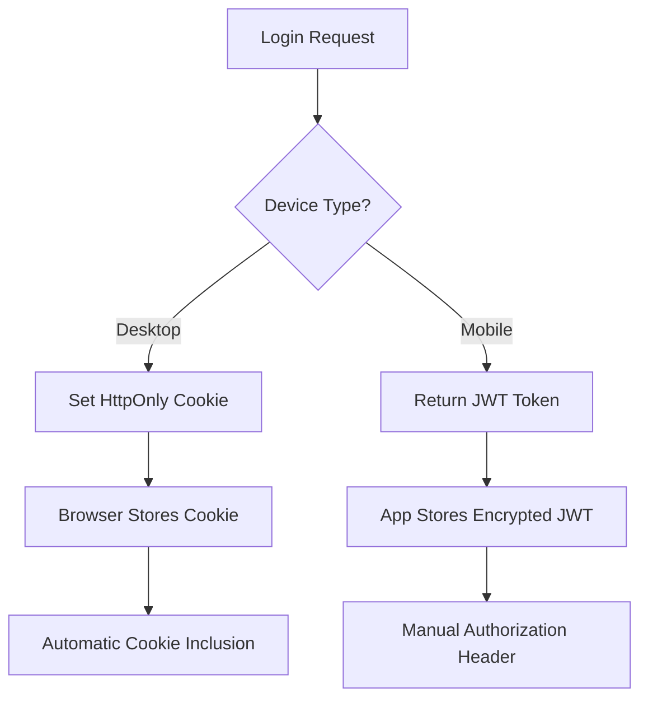

# Hybrid Authentication Strategy: Device-Aware Security

## 🎯 **Strategy Overview**

This document explains the architectural decision behind our hybrid authentication approach, addressing the fundamental question: **"Should an 8-hour login token be an httpOnly cookie instead of localStorage?"**

### **The Answer: It Depends on the Device**

```
Desktop → httpOnly Cookies (Maximum Security)
Mobile → Encrypted JWT in localStorage (Necessary Compromise)
```

## 🧠 **The Security Dilemma**

### **Why Not Just One Approach?**

**Option 1: HttpOnly Cookies Only**
- ✅ Perfect for desktop web browsers
- ❌ Impossible for React Native mobile apps
- ❌ Limited cross-domain capabilities

**Option 2: JWT in localStorage Only**
- ✅ Works everywhere
- ❌ Vulnerable to XSS attacks
- ❌ Not the most secure option for desktop

**Our Solution: Hybrid Approach**
- ✅ Best security for each platform
- ✅ Single backend handles both
- ✅ No compromise on security

## 🛡️ **Security Analysis by Platform**

### **Desktop Web Browser Security**

**HttpOnly Cookies Advantages:**
```typescript
// Browser automatically handles:
response.set_cookie(
    key="session_token",
    value=token,
    httponly=True,        // JavaScript cannot access
    secure=True,          // HTTPS only
    samesite="strict",    // CSRF protection
    max_age=8*60*60       // 8 hours
)
```

**Attack Vectors Mitigated:**
- ✅ **XSS Protection**: Malicious scripts cannot access token
- ✅ **CSRF Protection**: SameSite=strict prevents cross-site requests
- ✅ **Network Security**: Secure flag ensures HTTPS-only transmission
- ✅ **Automatic Cleanup**: Browser handles expiration

### **Mobile App Security**

**Why Cookies Don't Work for React Native:**
```javascript
// React Native limitation:
fetch('/api/protected', {
    credentials: 'include'  // ❌ Not supported in React Native
});

// Mobile apps need explicit token management:
fetch('/api/protected', {
    headers: {
        'Authorization': `Bearer ${token}`  // ✅ This works
    }
});
```

**JWT in localStorage with Encryption:**
```typescript
// Secure mobile token storage
class MobileAuthStorage {
    static encrypt(token: string): string {
        // Use crypto-js or similar
        return CryptoJS.AES.encrypt(token, SECRET_KEY).toString();
    }

    static store(token: string): void {
        const encrypted = this.encrypt(token);
        localStorage.setItem('mobile_auth_token', encrypted);
    }
}
```

## 🔄 **Device Detection Logic**

### **How We Determine Platform**

```python
# Backend device detection
def detect_device_type(request: Request) -> DeviceType:
    user_agent = request.headers.get("user-agent", "").lower()

    mobile_indicators = [
        "mobile", "android", "iphone", "ipad",
        "react-native", "expo", "cordova"
    ]

    # Check for mobile indicators
    is_mobile = any(indicator in user_agent for indicator in mobile_indicators)

    # Check for explicit client header
    client_type = request.headers.get("x-client-type", "").lower()
    if client_type == "mobile":
        is_mobile = True

    return "mobile" if is_mobile else "desktop"
```

### **Authentication Flow Differences**



## 📱 **Platform-Specific Implementation**

### **Desktop Authentication**

**Frontend (React Web):**
```typescript
// Desktop - NO token management needed
const login = async (email: string) => {
    const response = await fetch('/api/auth/login', {
        method: 'POST',
        credentials: 'include',  // Include cookies
        headers: { 'Content-Type': 'application/json' },
        body: JSON.stringify({ email })
    });

    // Token is automatically stored as httpOnly cookie
    return response.json(); // Returns user data, NO token
};

const makeAuthenticatedRequest = async (url: string) => {
    return fetch(url, {
        credentials: 'include'  // Browser sends cookie automatically
    });
};
```

**Backend Response:**
```python
# Desktop gets cookie, no token in response
return {
    "success": True,
    "user": user_data,
    "auth_method": "cookie",
    "expires_in": 8 * 60 * 60
}
# + httpOnly cookie set automatically
```

### **Mobile Authentication**

**Frontend (React Native):**
```typescript
// Mobile - Explicit token management
const login = async (email: string) => {
    const response = await fetch('/api/auth/login', {
        method: 'POST',
        headers: {
            'Content-Type': 'application/json',
            'X-Client-Type': 'mobile'  // Force mobile detection
        },
        body: JSON.stringify({ email })
    });

    const data = await response.json();

    // Store encrypted token
    await SecureStorage.setToken('auth_token', data.token);

    return data;
};

const makeAuthenticatedRequest = async (url: string) => {
    const token = await SecureStorage.getToken('auth_token');
    return fetch(url, {
        headers: { 'Authorization': `Bearer ${token}` }
    });
};
```

**Backend Response:**
```python
# Mobile gets JWT token in response body
return {
    "success": True,
    "token": jwt_token,  # ← Mobile needs this
    "user": user_data,
    "auth_method": "jwt",
    "expires_in": 8 * 60 * 60
}
# No cookie set
```

## 🔐 **Security Comparison Matrix**

| Attack Vector | Desktop (Cookies) | Mobile (JWT) | Mitigation |
|---------------|-------------------|--------------|------------|
| **XSS** | ✅ Protected (httpOnly) | ⚠️ Vulnerable | Encryption + CSP |
| **CSRF** | ✅ Protected (SameSite) | ✅ N/A (manual headers) | Origin validation |
| **MITM** | ✅ Protected (Secure flag) | ✅ Protected (HTTPS) | TLS enforcement |
| **Storage Access** | ✅ Browser-controlled | ⚠️ App-controlled | Encryption |
| **Network Interception** | ✅ Automatic HTTPS | ✅ Manual HTTPS | Certificate pinning |

## 🚀 **Implementation Benefits**

### **Developer Experience**
```typescript
// Same API, different internals
const { login, logout, user, isAuthenticated } = useAuth();

// Desktop: Uses cookies under the hood
// Mobile: Uses JWT tokens under the hood
// Frontend code is identical!
```

### **Security Benefits**
- **Maximum Security**: Each platform uses the most secure method available
- **Defense in Depth**: Multiple layers of protection per platform
- **Future-Proof**: Can adapt to new security standards per platform

### **Operational Benefits**
- **Single Backend**: One API handles both flows
- **Unified Monitoring**: All auth events in one place
- **Consistent UX**: Login flow feels the same on both platforms

## 🔧 **Configuration Management**

### **Environment-Based Settings**

```python
# Development
COOKIE_SECURE=false          # Allow HTTP for local testing
COOKIE_SAMESITE=lax          # Relaxed for development
MOBILE_TOKEN_ENCRYPTION=basic # Simple encoding

# Production
COOKIE_SECURE=true           # HTTPS only
COOKIE_SAMESITE=strict       # Maximum CSRF protection
MOBILE_TOKEN_ENCRYPTION=aes256 # Strong encryption
```

### **Runtime Configuration**

```typescript
const AUTH_CONFIG = {
    desktop: {
        method: 'cookie',
        storage: 'none',        // Browser handles it
        persistence: 'session', // Until browser closes
        security: 'maximum'     // HttpOnly + Secure + SameSite
    },
    mobile: {
        method: 'jwt',
        storage: 'localStorage',
        persistence: 'permanent', // Survives app restarts
        security: 'encrypted'     // AES encryption
    }
};
```

## 🧪 **Testing Strategy**

### **Cross-Platform Testing**

```javascript
// Test desktop cookie flow
describe('Desktop Authentication', () => {
    it('should set httpOnly cookie on login', async () => {
        // Mock desktop user-agent
        // Verify cookie is set, no token in response
    });
});

// Test mobile JWT flow
describe('Mobile Authentication', () => {
    it('should return JWT token on login', async () => {
        // Mock mobile user-agent
        // Verify token in response, no cookie set
    });
});
```

### **Security Testing**

```javascript
// Test XSS protection
describe('XSS Protection', () => {
    it('desktop tokens not accessible via JavaScript', () => {
        // Verify document.cookie doesn't contain token
    });

    it('mobile tokens are encrypted', () => {
        // Verify localStorage contains encrypted data
    });
});
```

## 📊 **Decision Matrix**

### **Why This Hybrid Approach?**

| Requirement | Pure Cookies | Pure JWT | Hybrid |
|-------------|--------------|----------|--------|
| **Desktop Security** | ✅ Excellent | ❌ Vulnerable | ✅ Excellent |
| **Mobile Support** | ❌ Impossible | ✅ Works | ✅ Works |
| **Developer Experience** | ❌ Complex | ✅ Simple | ✅ Simple |
| **Maintenance** | ❌ Multiple systems | ✅ Single system | ✅ Single system |
| **Future-Proof** | ❌ Limited | ⚠️ Depends | ✅ Adaptable |

## 🎯 **Conclusion**

**The Answer to "Should an 8-hour token be an httpOnly cookie?"**

✅ **Yes, for desktop browsers** - HttpOnly cookies provide maximum security
✅ **No, for mobile apps** - JWT tokens are necessary for React Native
✅ **Best of Both** - Our hybrid approach uses the optimal method for each platform

**Key Takeaway:**
> Security isn't one-size-fits-all. The best authentication strategy adapts to the capabilities and constraints of each platform while maintaining a unified, developer-friendly API.

This hybrid approach ensures that your 8-hour login tokens are stored as securely as possible on each platform, without sacrificing functionality or user experience.